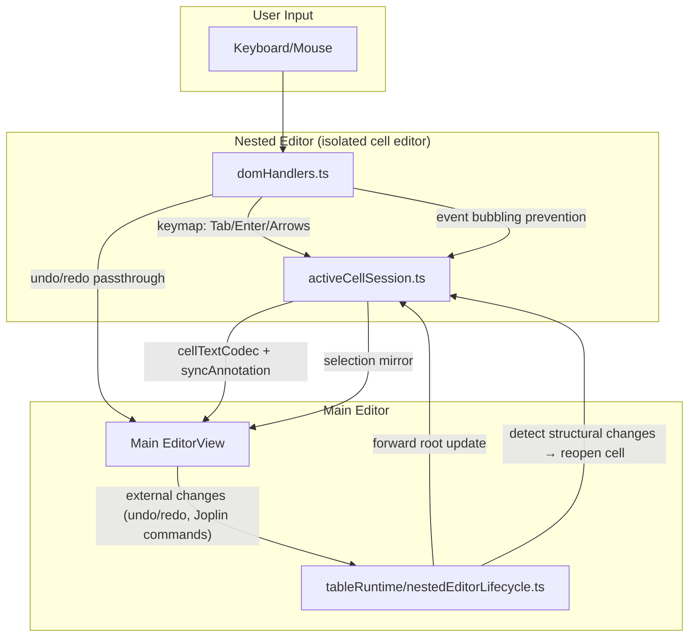

# Architecture Overview

A Joplin plugin that replaces Markdown table syntax with interactive `TableWidget` decorations using CodeMirror 6.

## Content Script Layers

- `tableModel/`: pure table parsing, serialization, and table math.
- `tableState/`: CodeMirror `StateField`/`StateEffect` definitions and selectors.
- `tableRuntime/`: editor-bound orchestration, lifecycle, navigation, and mutation helpers.
- `tableWidget/`: widget rendering, DOM helpers, widget visuals, and widget-local event handling.
- `tableCommands/`: Joplin command registration only.
- `nestedEditor/`: isolated in-cell editor implementation.
- `services/`: Joplin/external integration.
- `shared/`: generic helpers with no table-feature ownership.

## Documentation Index

- [Table-Display.md](./Table-Display.md) - Rendering, optimizations, display modes.
- [Nested-Editor-Architecture.md](./Nested-Editor-Architecture.md) - Synchronization, boundary enforcement, undo/redo.
- [Interaction-and-Navigation.md](./Interaction-and-Navigation.md) - Keyboard navigation, selection logic.
- [Structural-Commands-and-Serialization.md](./Structural-Commands-and-Serialization.md) - Command flow, serialization.
- [Markdown-Rendering.md](./Markdown-Rendering.md) - Cell Markdown rendering, context injection.
- [Table-Parsing.md](./Table-Parsing.md) - Table parsing and cell-range computation.
- [ADR/](../ADR/) - Architecture Decision Records.

---

## Editor Hierarchy

1. **Main Editor (CodeMirror)**: Parses document, identifies table ranges via Lezer syntax tree.
2. **Table Widget**: Block decoration replacing raw Markdown. Renders HTML table grid.
3. **Nested Editor**: Transient isolated CodeMirror instance spawned inside `<td>` for in-cell editing.

## Core Components

| Component     | File                                                 | Purpose                                                    |
| :------------ | :--------------------------------------------------- | :--------------------------------------------------------- |
| **Wiring**    | `contentScript/tableWidget/tableWidgetExtension.ts`  | Main entry point; connects plugins, styles, commands.      |
| **Rendering** | `contentScript/tableWidget/TableWidget.ts`           | HTML rendering, click-to-cell coordinate mapping.          |
| **Lifecycle** | `contentScript/tableRuntime/nestedEditorLifecycle.ts` | Nested editor open/close state, synchronization triggers.  |
| **Styles**    | `contentScript/tableWidget/tableStyles.ts`           | CSS-in-JS for theme consistency.                           |
| **Editor**    | `contentScript/nestedEditor/nestedCellEditor.ts`     | Public facade over the active-cell session editor.         |
| **Parsing**   | `contentScript/tableModel/MarkdownTable.ts`          | Normalized table model, parsing, serialization, mutations. |
| **Context**   | `contentScript/tableModel/tableContext.ts`           | Shared parsed table + cell ranges + table span.            |
| **State**     | `contentScript/tableState/activeCellState.ts`        | Logical active-cell state and effect wiring.               |
| **Runtime**   | `contentScript/tableRuntime/tableOperations.ts`      | Table mutation orchestration and target-cell rebasing.     |
| **Toolbar**   | `contentScript/toolbar/tableToolbarPlugin.ts`        | Floating UI for row/column/alignment actions.              |

## Data Flow

### 1. Detection

StateField scans syntax tree → detects table blocks → replaces with `TableWidget`.

### 2. Interaction

Cell click / navigation / selection focus → widget/runtime logic resolves row/column → dispatches
`setActiveCellEffect` plus an open-intent effect → `tableRuntime/nestedEditorLifecycle` mounts the nested editor.

`ActiveCell` is logical-first state: it persists `anchorPos` plus `section/row/col`. Raw offsets such as
`tableFrom`, `tableTo`, and `cellFrom/cellTo` are derived on demand through the shared active-cell resolver.

Before lifecycle opens the nested editor for user-driven entry, `nestedCellEditor.ts` checks whether the table markdown is
already in the plugin's canonical serialized form. If not, it rewrites the whole table once, preserves the logical target
cell, dispatches a reopen intent, rebuilds the widget, and only then opens the nested editor. Lifecycle reopens used for
undo/redo or UI restoration skip that normalization step. Passive parsing/rendering never mutates document text.

### 3. Synchronization

Typing in the isolated cell editor goes through the `ActiveCellSession` bridge:

- `editorBridge/cellTextCodec.ts` sanitizes local display text and selection into authoritative root cell text and selection.
- The main editor applies the change with `editorBridge/syncAnnotation.ts`.
- Non-sync root changes re-resolve the logical cell from the mapped anchor position and rebase the isolated editor.
- The nested editor is cell-local, not a clipped whole-document subview.

### 4. Table Runtime Model

`MarkdownTable` is the canonical runtime representation for parsed tables:

- Parses Markdown into normalized header/alignment/body state.
- Owns serialization and structural row/column/alignment operations.
- Feeds command execution and widget rendering through `TableContext`.
- Leaves source-coordinate computation to `markdownTableCellRanges.ts`.

### 5. Shared Derived Table Context

`TableContext` bundles:

- The resolved table span in the document (`from`, `to`, `text`).
- The parsed `MarkdownTable`.
- The computed `cellRanges` used for activation and navigation.

This is the shared derived object used across widget rendering, table interactions,
navigation, and command helpers so the plugin does not repeatedly run separate
resolve -> parse -> compute-ranges chains for the same table content.

The active-cell resolver builds on `TableContext` and is the only supported way to
derive current table/cell offsets for the persisted logical active-cell state.

### 6. Shared Transition Policy

Table editing transition logic is split by responsibility:

- `tableRuntime/lifecyclePolicy.ts` is pure lifecycle policy: it inspects `ViewUpdate` state and returns declarative lifecycle actions.
- `tableRuntime/nestedEditorLifecycle.ts` executes lifecycle side effects such as open/close and RAF scheduling.
- `editorBridge/mainEditorGuardPolicy.ts` owns main-editor transaction filtering and paste rewrite decisions while nested editing is active.
- `tableWidget/tableDecorationPolicy.ts` owns block-decoration rebuild decisions.
- `nestedEditor/activeCellSession.ts` owns local/root synchronization, selection mirroring, and session invalidation.
- `editorBridge/cellTextCodec.ts` and `editorBridge/syncAnnotation.ts` own the cross-editor text/selection protocol.

`nestedEditor/nestedCellEditor.ts` is a lifecycle-internal gate: non-lifecycle modules should request opening via effects,
not import it directly.

**Sync Flow Diagram**:

