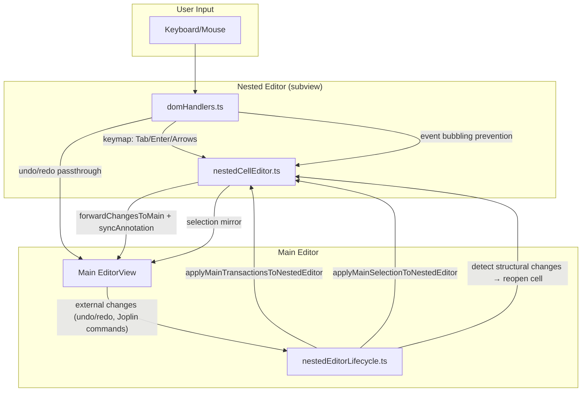

# Architecture Overview

A Joplin plugin that replaces Markdown table syntax with interactive `TableWidget` decorations using CodeMirror 6.

## Documentation Index

- [Table-Display.md](./Table-Display.md) - Rendering, optimizations, display modes.
- [Nested-Editor-Architecture.md](./Nested-Editor-Architecture.md) - Synchronization, boundary enforcement, undo/redo.
- [Interaction-and-Navigation.md](./Interaction-and-Navigation.md) - Keyboard navigation, selection logic.
- [Structural-Commands-and-Serialization.md](./Structural-Commands-and-Serialization.md) - Command flow, serialization.
- [Markdown-Rendering.md](./Markdown-Rendering.md) - Cell Markdown rendering, context injection.
- [Table-Parsing.md](./Table-Parsing.md) - Table parsing and cell-range computation.
- [ADR/](../ADR/) - Architecture Decision Records.

---

## Editor Hierarchy

1. **Main Editor (CodeMirror)**: Parses document, identifies table ranges via Lezer syntax tree.
2. **Table Widget**: Block decoration replacing raw Markdown. Renders HTML table grid.
3. **Nested Editor**: Transient CodeMirror instance spawned inside `<td>` for in-cell editing.

## Core Components

| Component     | File                                                  | Purpose                                                   |
| :------------ | :---------------------------------------------------- | :-------------------------------------------------------- |
| **Wiring**    | `contentScript/tableWidget/tableWidgetExtension.ts`   | Main entry point; connects plugins, styles, commands.     |
| **Rendering** | `contentScript/tableWidget/TableWidget.ts`            | HTML rendering, click-to-cell coordinate mapping.         |
| **Lifecycle** | `contentScript/tableWidget/nestedEditorLifecycle.ts`  | Nested editor open/close state, synchronization triggers. |
| **Styles**    | `contentScript/tableWidget/tableStyles.ts`            | CSS-in-JS for theme consistency.                          |
| **Editor**    | `contentScript/nestedEditor/nestedCellEditor.ts`      | ViewPlugin actualizing nested editor lifecycle.           |
| **Parsing**   | `contentScript/tableModel/MarkdownTable.ts`           | Normalized table model, parsing, serialization, mutations. |
| **Context**   | `contentScript/tableModel/tableContext.ts`            | Shared parsed table + cell ranges + table span.           |
| **Toolbar**   | `contentScript/toolbar/tableToolbarPlugin.ts`         | Floating UI for row/column/alignment actions.             |

## Data Flow

### 1. Detection

StateField scans syntax tree → detects table blocks → replaces with `TableWidget`.

### 2. Interaction

Cell click → `TableWidget` calculates row/column → dispatches `setActiveCellEffect` → `nestedEditorLifecycle` mounts nested editor.

`ActiveCell` is logical-first state: it persists `tableFrom` plus `section/row/col`. Raw offsets such as
`tableTo` and `cellFrom/cellTo` are derived on demand through the shared active-cell resolver.

### 3. Synchronization

Typing in nested editor → `forwardChangesToMain` creates transaction with `syncAnnotation` → main editor applies → annotation prevents re-render loop.

### 4. Table Runtime Model

`MarkdownTable` is the canonical runtime representation for parsed tables:

- Parses Markdown into normalized header/alignment/body state.
- Owns serialization and structural row/column/alignment operations.
- Feeds command execution and widget rendering through `TableContext`.
- Leaves source-coordinate computation to `markdownTableCellRanges.ts`.

### 5. Shared Derived Table Context

`TableContext` bundles:

- The resolved table span in the document (`from`, `to`, `text`).
- The parsed `MarkdownTable`.
- The computed `cellRanges` used for activation and navigation.

This is the shared derived object used across widget rendering, table interactions,
navigation, and command helpers so the plugin does not repeatedly run separate
resolve -> parse -> compute-ranges chains for the same table content.

The active-cell resolver builds on `TableContext` and is the only supported way to
derive current table/cell offsets for the persisted logical active-cell state.

### 6. Shared Transition Policy

Table editing transition logic is centralized in `contentScript/tableWidget/tableRuntimeTransitions.ts`.

- The module is pure policy: it inspects `Transaction`/`ViewUpdate` state and returns declarative decisions/actions.
- `nestedEditorLifecycle.ts` executes lifecycle side effects such as open/close, selection sync, and RAF scheduling.
- `tableWidgetExtension.ts` still owns block decoration materialization through `StateField`.
- `mainEditorGuard.ts` still owns transaction filtering, but delegates allow/reject/sanitize decisions to the shared policy.

**Sync Flow Diagram**:

